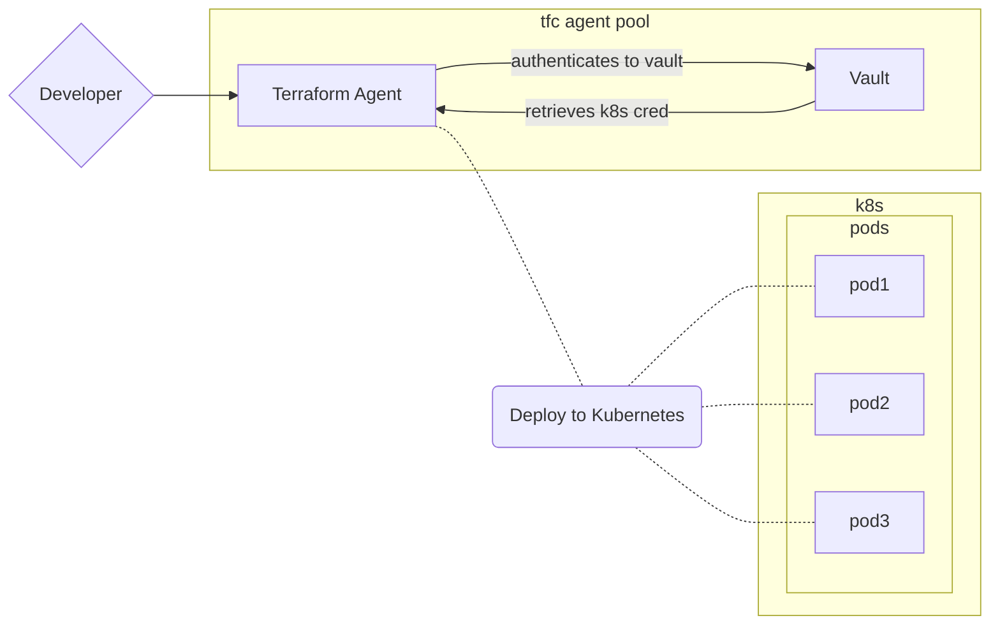

# vSphere Database as a Service

## Table of Contents
1. [Deploy a VM with Terraform](https://github.com/pandom/vsphere-vm-cli)
2. [Migrate workflow to Terraform Cloud](https://github.com/pandom/vsphere-vm-cli-ent)
3. [Deploy VM with a Terraform Module](https://github.com/pandom/vsphere-vm-module)
4. [Database as a Service](https://github.com/pandom/vsphere-db-vm) <- You are here

This repository will deploy the following topology

!insert topology here


## Purpose

The purpose of this demo is to deploy a DB VM and iteratively demonstrate the plug and play nature of modules and workflows that derive an outcome. In this example the outcome here demonstrates:

1. deploying a virtual machine
2. configuring the database secret role
3. configuring the boundary target

Each step, whilst providing the consumer a DB to consume, further improves the security posture and the hygiene of machine and user secrets.

### Add Vault Module
The image below outlines the next configuration changes:
#### Topology


#### Steps
Uncomment the `secrets-database` module and commit this code. Terraform will apply it and configure the secrets engine and role.

It will obtain the `database_server_ip` from `module.postgres[0].virtual_machine_ip`. This can also be a FQDN if you derive it from another source.

Once applied issue `value read 2111-database/creds/readonly` to retrieve the credential.

```
vault read 2111-database/creds/readonly
Key                Value
---                -----
lease_id           2111-database/creds/readonly/8JSW0ziMXDyTlphnGKReQJB5
lease_duration     768h
lease_renewable    true
password           81BlKiTacJwN-RmcfCW7
username           2111-readonly-1668999430-FurgaaXf
```

Validate the working credential with an SSH to the postgres box or alternatively from a network location.

The command `psql -U <DYNAMIC_USERNAME> -h <POSTGRESQL IP> postgres` would look like `psql -U 2111-readonly-1668999430-FurgaaXf -h 172.21.12.76 postgres`
#### Optional: Validate the role

You can further validate the Vault role to see how the `creation_statements` are reflected.

Issue `value read 2211-database/roles/readonly` to validate this.

```
vault read 2111-database/roles/readonly
Key                      Value
---                      -----
creation_statements      [CREATE ROLE "{{name}}" WITH LOGIN PASSWORD '{{password}}' VALID UNTIL '{{expiration}}'; GRANT CONNECT ON DATABASE postgres TO "{{name}}"; GRANT USAGE ON SCHEMA public TO "{{name}}"; GRANT SELECT ON ALL TABLES IN SCHEMA public TO "{{name}}";]
credential_type          password
db_name                  postgres
default_ttl              0s
max_ttl                  0s
renew_statements         []
revocation_statements    []
rollback_statements      []
```

Currently, `2111-database` is inheriting the secret engines `global_ttl` as reflected by the `0s` in the `default_ttl` field.

These can be adjusted to suit.

### Add Boundary Target module


test

